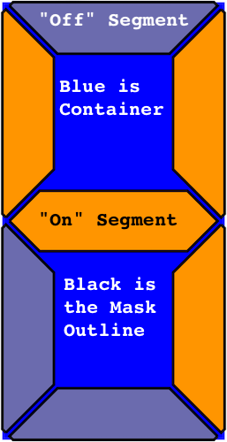

# `LGV_7_Segment`

## Overview

This module provides a struct that simply provides a primitive Core Graphics `CGPath` for a basic 7-segment display, and another struct that acts as an "aggregator," for the initial struct.

The `LGV_7_Sement` struct is a graphical representation of a classic "7-segment" LED/LCD display for a single digit.

The `LGV_7_Sement_Group` struct is an aggregator of `LGV_7_Sement` structs, and treats them as digits in a number, with various bases.

## Details

### The The `LGV_7_Sement` struct

The `LGV_7_Sement` struct does not provide diagonal segments, like displays that also render text characters. It just displays 0-F (0-15), and a single center segment (-).

It also does not actually *display* anything. It just provides primitive `CGPath` paths for the segments. These need to be used by the calling context to render the display.

It supplies 4 different paths:

- The path for all of the "on" segments. You get this from the `LGV_7_Segment.onSegments` computed property.
- The path for all of the "off" segments. You get this from the `LGV_7_Segment.offSegments` computed property.
- A path that encompasses all of the segments, whether on or off. This can be used as a mask. You get this from the `LGV_7_Segment.segmentMask` computed property.
- A simple rectangular path, for the outline of the display. You get this from the `LGV_7_Segment.outline` computed property.

Figure 1: The Various Paths, As Shown in the Tester App

The paths are calculated in realtime, and reflect the value and size of the display.

By default, the control calculates its layout, based on 250 display units wide, by 492 display units high.
However, the size can be set to anything, and the paths will fill it (stretching, if necessary).

There are two mutable properties for this struct:

- `LGV_7_Segment.size`: This is the actual size that the display is calculated to fill. It will cause stretching, if it is different from the 125:246 aspect ratio of the default size.
- `LGV_7_Segment.value`: This is an integer value, from -2, to 15.

 The value can be:
 
 - -2 is all off (blank). This is the default.
 - -1 is the negative sign (center bar only).
 - 0-15 are the hex values (0, 1, 2, 3, 4, 5, 6, 7, 8, 9, A, b, C, d, E, F).

It is possible to get the default aspect ratio, using the `LGV_7_Segment.defaultAspect` computed property, and the current aspect, using the `LGV_7_Segment.currentAspect` computed property.

### The The `LGV_7_Sement_Group` struct

Because the structs return `CGPath`s, the images can be scaled or transformed at very little cost, and used in Basic Swift, UIKit, SwiftUI, AppKit, WatchKit, or TV UIKit.

## License

MIT License
 
Permission is hereby granted, free of charge, to any person obtaining a copy
of this software and associated documentation files (the "Software"), to deal
in the Software without restriction, including without limitation the rights
to use, copy, modify, merge, publish, distribute, sublicense, and/or sell
copies of the Software, and to permit persons to whom the Software is
furnished to do so, subject to the following conditions:

The above copyright notice and this permission notice shall be included in all
copies or substantial portions of the Software.

THE SOFTWARE IS PROVIDED "AS IS", WITHOUT WARRANTY OF ANY KIND, EXPRESS OR
IMPLIED, INCLUDING BUT NOT LIMITED TO THE WARRANTIES OF MERCHANTABILITY,
FITNESS FOR A PARTICULAR PURPOSE AND NONINFRINGEMENT. IN NO EVENT SHALL THE
AUTHORS OR COPYRIGHT HOLDERS BE LIABLE FOR ANY CLAIM, DAMAGES OR OTHER
LIABILITY, WHETHER IN AN ACTION OF CONTRACT, TORT OR OTHERWISE, ARISING FROM,
OUT OF OR IN CONNECTION WITH THE SOFTWARE OR THE USE OR OTHER DEALINGS IN THE
SOFTWARE.
